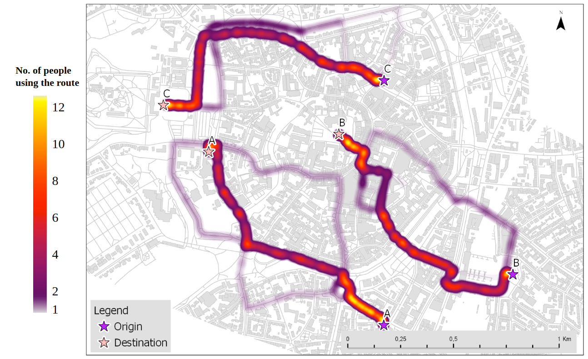

# pedestrian-routing
This is the repository to store the work that has been done for the **Evaluating routing-algorithm approaches for pedestrian behaviour simulation** course in the University of Muenster 2019.

Shortest Distance (A*) with landmarks |  Least Angular Change and Landmark using Djikstra
:-------------------------:|:-------------------------:
 | 

## Content

1. [Landmark Extraction](https://github.com/ismailsunni/routing-with-landmark/blob/master/landmark-extraction.py)
2. [Shortest Distance (A*) with landmarks](https://github.com/ismailsunni/routing-with-landmark)
3. [Least Angular Change and Landmark using Djikstra](github.com)
4. [Comparison metric](github.com)

## Team Members

1. Benjamin Amir Karic
2. Ismail Sunni
3. Lia Kirsch
4. Tina Baidar

## Results

*Heat map of number of participants taking various routes*

*Bar chart with error bars representing overall comparison result from (a) Hausdorff distance and (b) Area between the routes*

*Results for route A with (a) Map showing the computed and observed routes, and Bar chartwith error bars showing results from (b) Hausdorff distance (c) Area between the routes*
